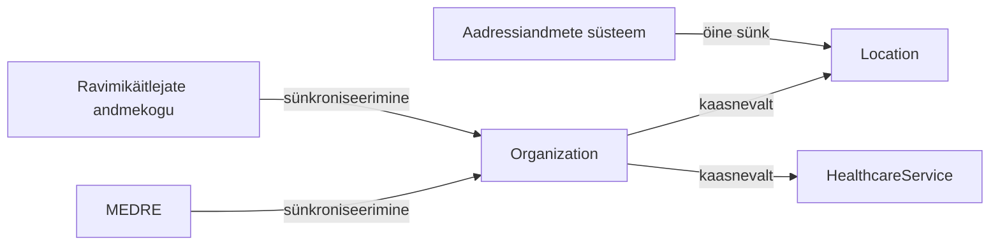

Käesolev leht kirjeldab Organization, Location ja HealthcareService ressursside päringu ärireegleid —
eelkõige seda, millal ja kuidas SPD sünkroniseerib andmeid taustal välisregistritest. Konkreetsed
päringu- ja vastusenäited on toodud lehel [FHIR API kirjeldus](fhir-api.html).

### Andmete allikad

- **Organization**: Tervishoiuteenuste korraldamise infosüsteemi register **MEDRE** (tegevusload ja
  teenuseosutajad) ning **Ravimikäitlejate andmekogu** (apteegiteenuse tegevusload).
- **Location**: aadressiandmed loetakse SPD kohalikust andmebaasist (`ads_address`), mida
  uuendatakse öise **Aadressiandmete süsteemi (ADS)** sünkroniseerimisega — vt
  [Taustsünkroniseerimine välisregistritega](sunkroniseerimine.html). Otsingul ei tehta ADS-i
  reaalajas päringut.
- **HealthcareService**: ei sünkroniseerita otse ühestki registrist — tekib alati kaasnevalt
  Organization sünkroniseerimisel.

### Organization ehk asutuse päring

Kui asutust `_id` või `identifier` alusel SPD-s ei leita, käivitatakse taustal sünkroniseerimine
allikregistrist ning tulemus salvestatakse SPD-sse enne vastamist.

- `identifier`: asutuse äriregistrikood, süsteem `https://fhir.ee/sid/org/est/br` — see väärtus
  käivitab vajadusel sünkroniseerimise.
- `name`: asutuse nime osaline vaste (mittetäht­tundlik), otsib ainult SPD juba teadaolevate
  asutuste seast, sünkroniseerimist ei käivita.
- `_id`: SPD süsteemne id.

Puudumisel tagastatakse `SPD-003` (id alusel) või `SPD-040` (koodi alusel) — vt [Vead](vead.html).

### Location ehk tegevuskoha otsing

Otsing nõuab vähemalt ühte põhifiltrit (`organization.identifier`, `identifier`, `_id`,
`practitionerRole` või `addressCode`) — vastasel juhul `SPD-018`.

- `organization.identifier` alusel otsimine käivitab vajadusel asutuse sünkroniseerimise (samamoodi
  nagu Organization päringul), kui asutust SPD-s veel ei ole.
- `identifier` on aadressi ADS adr_id. Kui aadressi ei leita SPD kohalikust aadressitabelist,
  tagastatakse hoiatus `SPD-006` `OperationOutcome`-is, kuid otsing tervikuna ei ebaõnnestu.
- `_id`-põhine **päring** (mitte otsing) arvutab tegevuskoha staatuse (`active`/`suspended`/
  `inactive`) alati värskelt ümber ja vajadusel salvestab uue versiooni; **otsing** kasutab viimati
  salvestatud staatust ega arvuta seda ümber. Ajaloopäring (`vread`) tagastab alati vastava
  versiooni ajastu staatuse (staatust tagantjärele ei arvutata ümber). Otsingu tulemus ei ole
  seetõttu üldjuhul aegunud — taustal töötav ajastatud töö arvutab kõigi kehtivate tegevuskohtade
  staatused perioodiliselt ümber ja salvestab muudatused, sõltumata sellest, kas kedagi neid `_id`
  alusel vahepeal pärib.

### HealthcareService ehk tervishoiuteenuse päring

Otsing nõuab vähemalt ühte põhifiltrit (`_id`, `service-type`, `organization.identifier`, `license`
või `location`) — vastasel juhul `SPD-018`. `identifier` HealthcareService otsinguparameetrina ei
ole toetatud.

Kuna HealthcareService ei sünkroniseerita kunagi otse, tuuakse see andmestikku ainult kaasnevalt:
kui `organization.identifier` alusel otsides asutust SPD-s (veel) ei ole, käivitub asutuse
sünkroniseerimine, mille käigus luuakse ka vastavad HealthcareService kirjed. Kui asutus on SPD-s
juba olemas, ei käivitata sünkroniseerimist uuesti — ka juhul, kui otsingule vastavaid teenuseid ei
leidu (näiteks on need vahepeal registrist kadunud). Tulemuse puudumisel pärast põhifiltri
rakendamist tagastatakse `SPD-017`.

Vt ka [Kontrollid ja terminoloogia](kontrollid.html) kasutatavate koodisüsteemide kohta ja
[Kasutuslood](kasutuslood.html) (UC-SPD-021, UC-SPD-026, UC-SPD-027).
